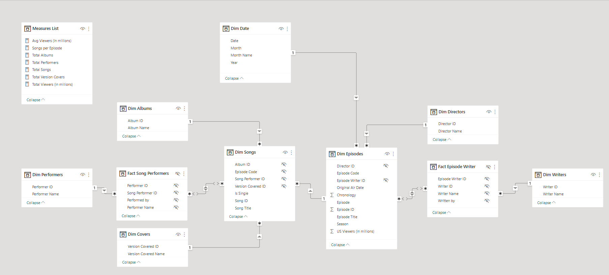

# Glee Power BI Dashboard


This project aims __to design a Power BI dashboard that contains summary statistics about songs covered in the TV show Glee__.

To do this, the project aims to:
1. Extract data from the show's Wikipedia pages ([songs](https://en.wikipedia.org/wiki/Lists_of_songs_in_Glee_(TV_series)), [episodes](https://en.wikipedia.org/wiki/List_of_Glee_episodes))
2. Transform and normalize data using Python
3. Create visualizations using Power BI

---

## Context

As a Glee fan, I have always been curious how many covers the show has done and the various details of these covers, such as which character did the most covers, which artist or band did the show cover the most, etc. 

Since I need to practice my data modelling skills, I decided to do this project to kill two birds with one stone. In doing so, I came across the topic of database normalization, which I implemented in Python. 

Once I had normalized the data, it was easy to create the necessary visualizations in Power BI.

## Files

```
glee-dashboard/
|
├─ assets/
|  ├─ data_model.png                 - entity relationship diagram
|  └─ logo.png                       - glee logo
|
├─ data/ 
|  ├─ dim_albums.csv
|  ├─ dim_covers.csv
|  ├─ dim_directors.csv
|  ├─ dim_episodes.csv
|  ├─ dim_performers.csv
|  ├─ dim_songs.csv
|  ├─ dim_writers.csv
|  ├─ fact_episode_writer.csv
|  └─ fact_song_performers.csv
|
├─ .gitignore                        - list of files to exclude from git 
├─ dashboard                         - main Power BI dashboard 
├─ etl_episodes.py                   - ETL script for episodes data
├─ etl_songs.py                      - ETL script for songs data
├─ README.md                         - documentation
├─ theme.json                        - Power BI color theme
└─ util.py                           - utility/helper functions
```

## Final Data Model



## Final Dashboard

